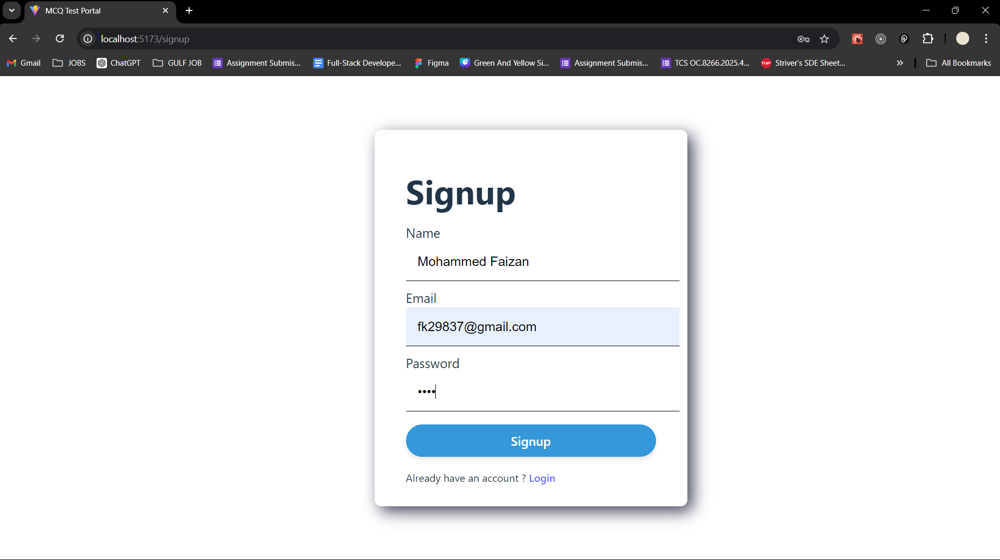
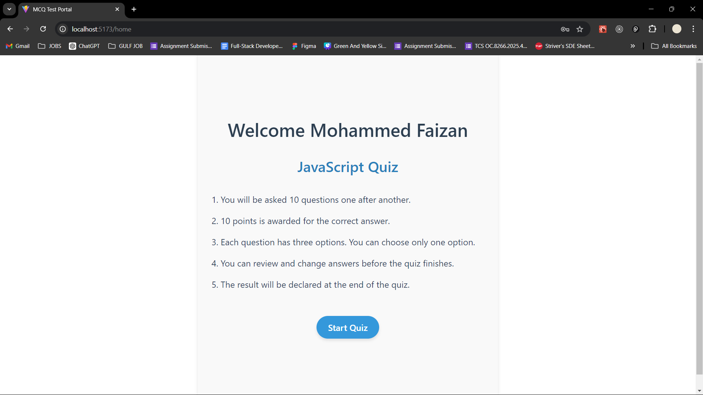
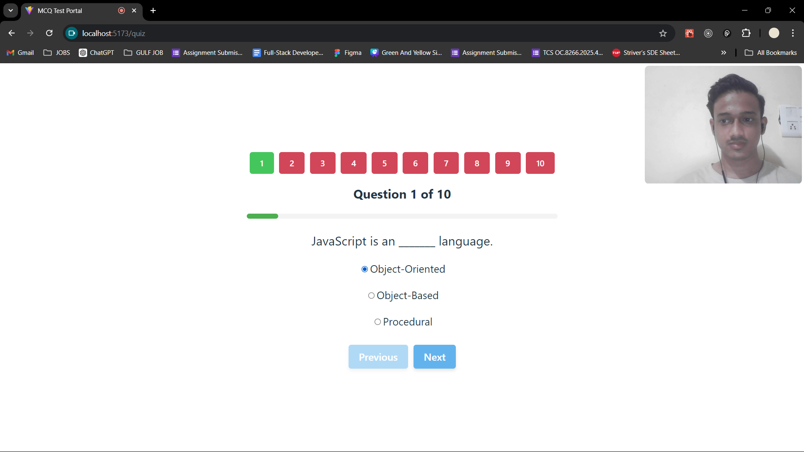
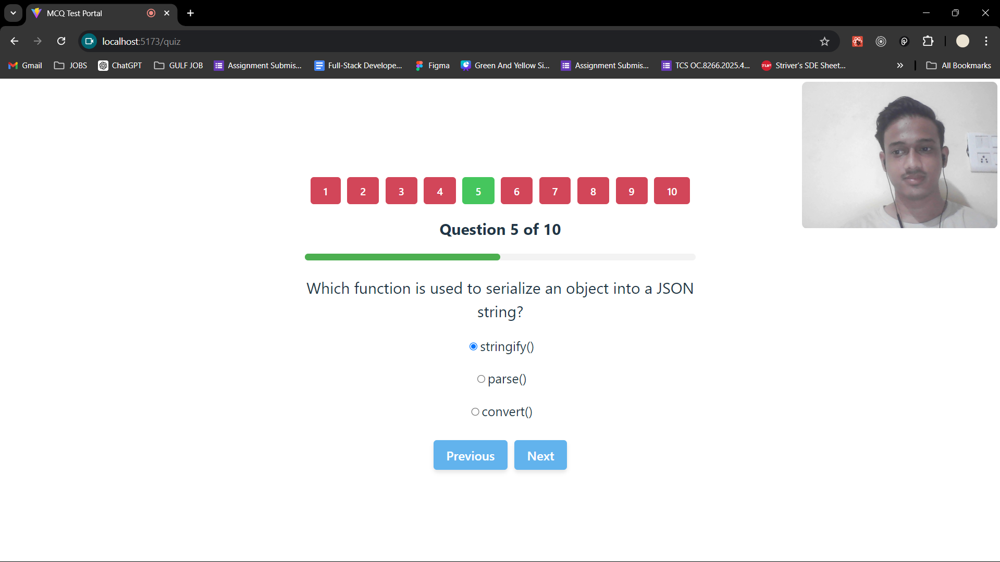
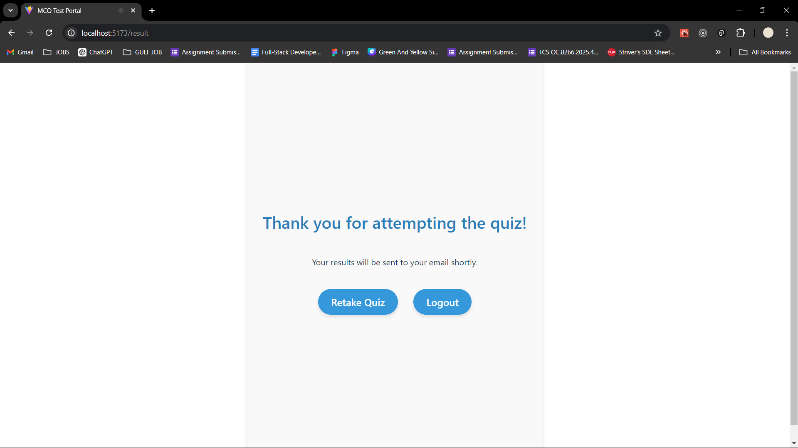
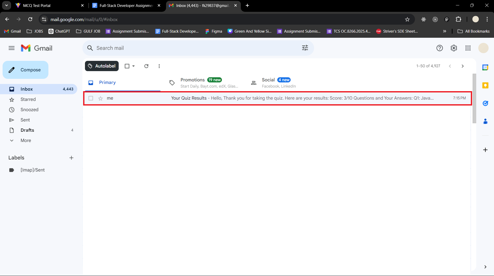
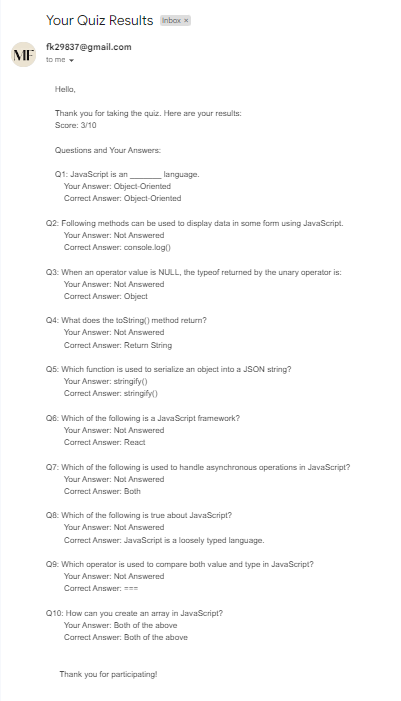
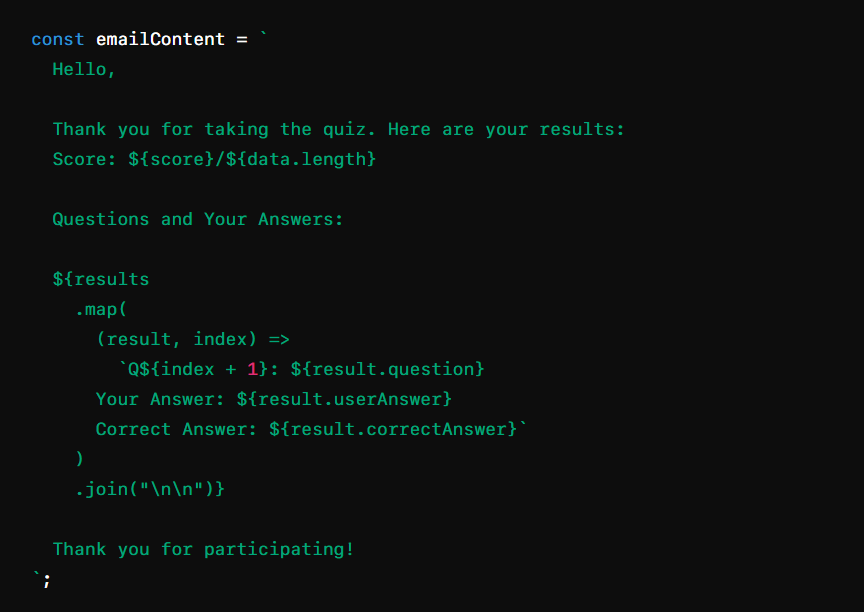
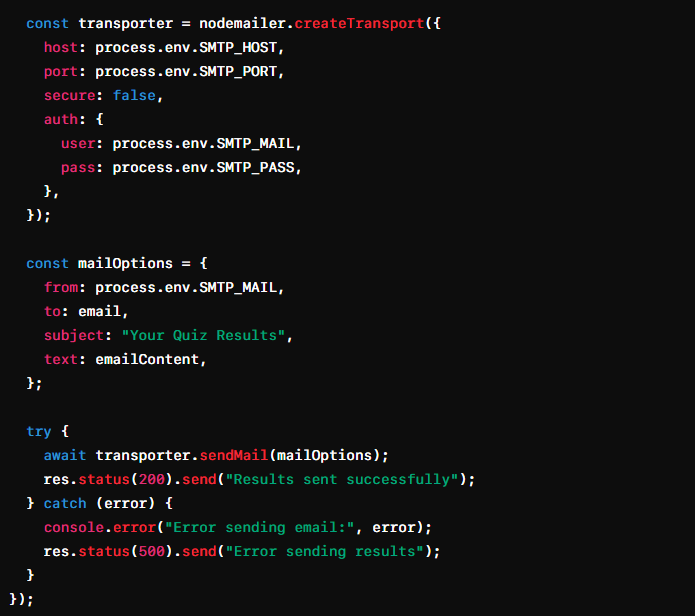

# CipherSchools - MCQ Test Portal

🌟✨ The goal of this project is to create a web-based platform that offers a seamless and secure experience for students taking MCQ tests. The platform focuses on providing a robust user authentication system, an intuitive test-taking interface, and automated result processing. ✨🌟

### Click  [here](link) to view in your browser. 🌐👀

## User Account for Testing

Login and attempt the test, you can use the following demo credentials:

- Email: rahul@gmail.com
- Password: Rahul@1234

Please note that the result will not be shared. If you want to receive the result, make sure to sign up with your email. We prioritize your security and we do not store your password.🔒📧✨


## Features

- **Secure Login:** 🔒 Users can log in using their email and password.
- **Protected Routes:** 🚧 Ensures that only authenticated users can access the test environment.

- **Interactive Questions:** 📝 Users can view each question and its multiple-choice options.
- **Answer Selection:** ✅ Allows users to select and modify their answers easily.
- **Navigation:** 🚀 Users can freely navigate between questions without restrictions.
- **Integrated Camera Window:** 📷 The interface includes a small window displaying the live camera feed during the test.

- **Submission Process:** 📤 Users can submit their answers upon completing the test, redirecting them to a "Finish Test" page.
- **Automatic Evaluation:** ✔️ The platform automatically evaluates the answers, calculates the score.
- **Email Notification:** 📧 The score is sent to the user's email using a predefined template, ensuring prompt and accurate communication of results.

## Technologies Used

- **React:** ⚛️ A JavaScript library for building user interfaces.
- **Node.js:** 🟢 A JavaScript runtime built on Chrome's V8 JavaScript engine.
- **Express:** 🌐 A minimal and flexible Node.js web application framework.
- **MongoDB:** 🍃 A NoSQL database for storing user data. 
- **JWT (JSON Web Token):** 🔐 Used for securely transmitting information between parties as a JSON object, ensuring secure user authentication.
- **Nodemailer:** 📨 A module for Node.js applications to send emails, used for sending test results to users.

## Setup and Installation for Frontend

1. **Clone the repository**
    ```bash
    git clone <repository-url>
2. **Navigate to the project directory**

    ```bash
    cd frontend
3. **Install dependencies**

    ```bash
    npm install 
4. **Start the application**

    ```bash
    npm run dev
    
The frontend will start running on http://localhost:5173. 🚀🌐

## Setup and Installation for Backend

1. **Clone the repository**
    ```bash
    git clone <repository-url>
2. **Navigate to the project directory**

    ```bash
    cd backend
3. **Install dependencies**

    ```bash
    npm install 
4. **Start the application**

    ```bash
    npm start 
5. **Connect to MongoDB**
    Ensure MongoDB is installed and running on your system. Update the connection string in the .env file if necessary.
    
The backend server will start running on http://localhost:5000. 🚀🌐

## .env
1. **MONGO_DB_URL="your_mongodb_connection_string"**
2. **JWT_SECRET="faizan1234"**
3. **SMTP_HOST="smtp.gmail.com"**
4. **SMTP_PORT=587"**
5. **SMTP_MAIL="your_email@example.com"**
6. **SMTP_PASS="your_email_password"**

## Images

1. **Signup**
    The signup page where users create a new account by entering Name, Email and Password.
    

2. **Login**
    The login page where users can enter their credentials to access the home page.
    

3. **Home**
    The home page displayed after login, showing information about the test.
    

4. **Quiz**
    The quiz interface where users can answer multiple-choice questions, navigate between them, and view the camera feed.
    
    
    

5. **Result**
    The result page displaying a message indicating that the results have been shared to your email.
    
    
    
    


6. **NodeMailer Code**
    The Nodemailer  is a Node.js module that enables sending emails from  application making it ideal for automating tasks like sending quiz score.
    
    
    


## Acknowledgements

- Thanks to [React](https://reactjs.org/) for the great front-end library.
- Thanks to [Node.js](https://nodejs.org/) and [Express.js](https://expressjs.com/) for the robust back-end framework.
- Inspiration from various open-source projects and documentation.


## Contact

For any questions or feedback, feel free to reach out  [Mohammed Faizan](mailto:fk29837@example.com).


## Contributing

Contributions to the project are welcome. Please follow the standard fork and pull request workflow. 🤝🌟


